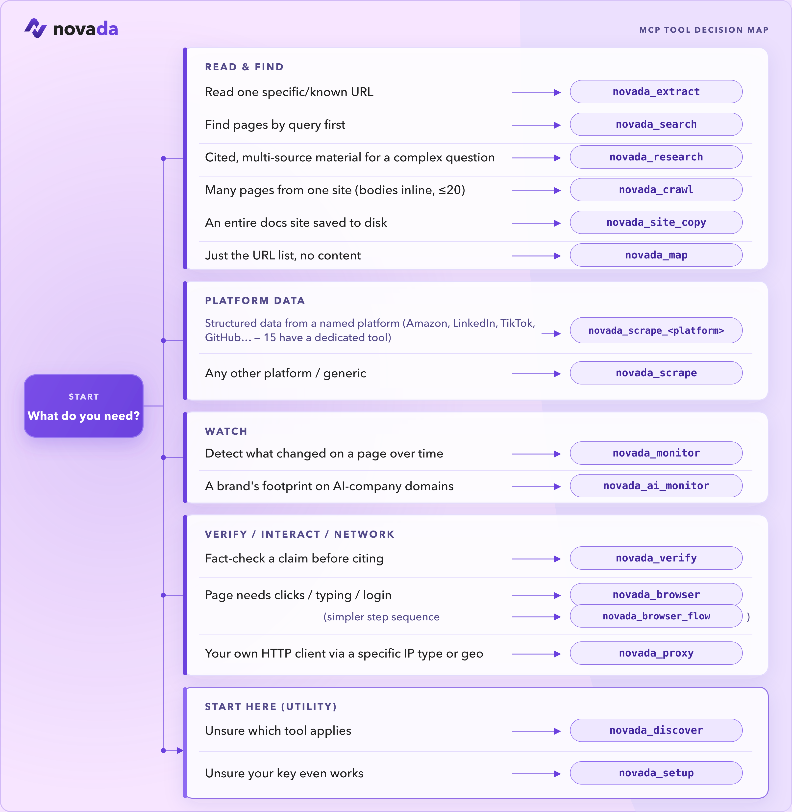

# Novada MCP

**One MCP server for the entire live web.** Search, extract, scrape, crawl, proxy, browser automation, and AI-powered research — behind a single hosted connection, or one local install if you'd rather run it yourself.

[screenshot: Novada connected in an MCP client, tool list visible]

[](https://www.npmjs.com/package/novada-mcp)
[](https://www.npmjs.com/package/novada-mcp)
[](https://github.com/NovadaLabs/novada-mcp/actions/workflows/ci.yml)
[](npm-package/LICENSE)

[Quickstart](#quickstart) · [Get your key](#get-your-key) · [How to choose a tool](#how-to-choose-a-tool) · [Why Novada](#why-novada) · [Repository layout](#repository-layout) · [Links](#links)

[](https://www.novada.com)

|  |  |
|:--|:--|
| **✅ Works with any MCP client** — Claude, Cursor, Windsurf, VS Code, or `npx` locally | **🎯 15 typed per-platform scrapers** — Amazon, Google, LinkedIn, TikTok, … each a closed `operation` enum, so an agent can't call an invalid op |
| **🎁 $10 free credits — no credit card needed** — up to 1,000 calls/month | **⚡ Hosted-first, zero install** — point at one URL, or self-host in one command |

---

## Quickstart

Novada is **hosted-first** — there's nothing to install. Point your client at the hosted URL and you're done.

> **Security note:** the hosted URL contains your API key in the `?token=` parameter — treat it like a password. Never share it, never post it publicly, and never configure it as a shared or organization-level connector.

### claude.ai (web)

1. Go to **Settings → Connectors → Add custom connector**.
2. Name it `Novada`.
3. Paste the URL (contains your key — see security note above):
   ```
   https://mcp.novada.com/mcp?token=YOUR_KEY
   ```
4. Click **Add**.

### Claude Code

```bash
claude mcp add --transport http novada "https://mcp.novada.com/mcp?token=YOUR_KEY"
```

**Full per-client install (Cursor/Windsurf/VS Code + local self-host) → [npm-package/README.md](./npm-package/README.md).**

### Try it

```
novada_setup()                                          — validates your key, shows balance
novada_search({query: "Claude MCP tutorials"})          — web search
novada_extract({url: "https://example.com"})            — read any URL
novada_research({question: "how do MCP servers work?"}) — parallel multi-source research
```

[screenshot: agent calling novada_search and returning results]

---

## Get your key

1. Sign up at [novada.com](https://www.novada.com) — no credit card required.
2. Copy your API key from [novada.com](https://www.novada.com).
3. You start with **$10 in free credits**, capped at **1,000 calls/month**. Check what's left any time with `novada_account({section: "balance"})` or `novada_setup()`.

---

## How to choose a tool

[](https://www.novada.com)

These are the tools you reach for most:

| Tool | Use it when |
|------|-------------|
| `novada_setup` | **First run** — validate your key and see your balance. Start here. |
| `novada_search` | Find pages by query (google / duckduckgo / yandex; time, domain, geo filters). |
| `novada_extract` | Read one known URL — or up to 10 in parallel — through anti-bot pages. |
| `novada_research` | Answer a complex question — parallel multi-source search + extraction in one call. |
| `novada_scrape` | Structured records from 16 platforms (Amazon, LinkedIn, TikTok, …). Plus **15 typed per-platform tools** — `novada_scrape_amazon`, `_google`, `_linkedin`, … — each a closed `operation` enum. |
| `novada_crawl` | Pull content from a bounded set of related pages (≤20) on one site. |
| `novada_map` | Discover what URLs exist on a site before fetching. |
| `novada_browser` | Interact with a page — click, type, screenshot, run JS. |
| `novada_proxy` | Route your own HTTP client through a specific IP type / country / session. |

**Not sure?** Call `novada_discover` and it returns the full catalog with each tool's status.

📚 **[Full reference — all 38 tools →](docs/TOOLS.md)**

**38 tools across 6 categories.** Self-host (`npx novada-mcp`) exposes all 38. The hosted default surface (`mcp.novada.com`) exposes **30** — the same registry minus 8 tools that don't apply to a stateless serverless endpoint (write-gated account mutations, per-process debug state, and two browser tools that need a persistent process) — it is core-derived, not a hand-curated subset. Call `novada_discover` on your connection to see exactly what's available on it.

---

## Why Novada

- **15 dedicated per-platform scrapers.** `novada_scrape_amazon`, `_google`, `_bing`, `_duckduckgo`, `_yandex`, `_youtube`, `_instagram`, `_facebook`, `_tiktok`, `_x`, `_walmart`, `_shein`, `_linkedin`, `_github`, `_perplexity` — each exposes a closed, typed `operation` enum scoped to that platform instead of the generic `novada_scrape`'s open `platform`+`operation` string pair, so an agent can't guess an invalid operation for the wrong platform.
- **Honest tool surface.** Every listed `operation` is verified-working — operations we can't currently deliver are marked and excluded, not left in to fail on you mid-task.
- **Contract-tested self-report.** Tool descriptions are tested against actual behavior, not just written and forgotten — what a tool claims to return is checked against what it actually returns.
- **Drift-guarded tool registry.** `npm-package/src/tools/registry.ts` is the single source of truth for the tool catalog; a test asserts the registered tools, the wired tools, and the `novada_discover` output can never diverge.
- **`confirm:true` write-gate.** Every mutating tool (proxy sub-account creation, IP whitelist changes, static IP purchases, capture-key resets) requires an explicit two-step confirmation — no silent writes.
- **Callable onboarding.** `novada_discover` and `novada_setup` are tools your agent can call itself to find the right tool or validate a key, without ever reading this README.

---

## Repository layout

This is a **monorepo** with two artifacts:

- **`npm-package/`** — the `novada-mcp` npm package. Local stdio MCP server (`npx novada-mcp`); source of truth for all tool logic.
- **`hosted-server/`** — what runs at `https://mcp.novada.com`. An HTTP wrapper (auth, quota, rate-limit) on Vercel around the npm package's built output.

**Full architecture map (entrances, dispatch core, where-does-X-live) → [ARCHITECTURE.md](./ARCHITECTURE.md); contributor routing → [CONTRIBUTING](./npm-package/CONTRIBUTING.md).**

---

## Links

- Website: [novada.com](https://www.novada.com)
- Get an API key: [novada.com](https://www.novada.com)
- Sign up (free): [novada.com](https://www.novada.com)
- npm: [npmjs.com/package/novada-mcp](https://www.npmjs.com/package/novada-mcp)
- GitHub: [github.com/NovadaLabs/novada-mcp](https://github.com/NovadaLabs/novada-mcp)
- Issues: [github.com/NovadaLabs/novada-mcp/issues](https://github.com/NovadaLabs/novada-mcp/issues)

## License

MIT
